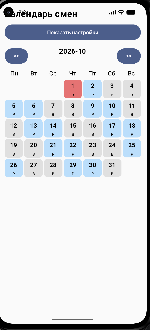
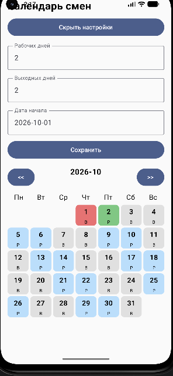
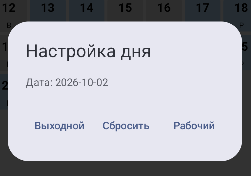

# Календарь смен

Android-приложение для людей, которые работают по сменному графику: «два через два»,
«три через три», «сутки через трое». Показывает, рабочий ли день, и считает смены
на любой месяц вперёд без ручного заполнения календаря.

<p align="center">
  
  
  
</p>

## Зачем это нужно

Обычные календари не знают про цикл смен. Чтобы отметить рабочие дни, приходится
вручную создавать события на месяцы вперёд — на год это 150–180 записей, а при смене
графика всё приходится переделывать. Приложение решает это одним числом: задаёшь,
сколько дней работаешь и сколько отдыхаешь, — и календарь считается сам.

## Возможности

- **Настройка графика** — пользователь сам вводит число рабочих и выходных дней.
- **Автоматический расчёт** — смены считаются на любой месяц, включая переход между годами.
- **Листание месяцев** — кнопки «<<» и «>>» с мгновенным пересчётом сетки.
- **Ручная правка дня** — диалог «Настройка дня» с тремя действиями: «Рабочий»,
  «Выходной», «Сбросить».
- **Приоритет правки** — решение пользователя важнее расчёта по циклу.
- **Цветовая индикация** — синий рабочий, серый выходной, зелёный и красный — правка вручную.
- **Безопасный ввод** — буквы в поле не роняют приложение.
- **Работает без интернета** — все данные хранятся на устройстве.

## Стек

| Что | Чем |
|---|---|
| Язык | Kotlin 2.2.10 |
| Интерфейс | Jetpack Compose, Material 3 |
| Сборка | Gradle (Kotlin DSL), version catalog |
| Минимальная версия | Android 8.0 (API 26) |
| Работа с датами | `java.time` (`LocalDate`, `YearMonth`, `ChronoUnit`) |

## Как считается смена

День считается рабочим, если остаток от деления числа дней, прошедших с начала графика,
на длину цикла меньше числа рабочих дней:

```kotlin
val diff = ChronoUnit.DAYS.between(start, date)
val byCycle = diff >= 0 && workDays + restDays > 0 && diff % (workDays + restDays) < workDays
```

Например, для графика «2/2» с началом 1 октября 2026: 1 и 2 октября — рабочие,
3 и 4 — выходные, 5 и 6 — снова рабочие. Ручная правка конкретного дня имеет приоритет
над этим расчётом.

## Структура проекта

```
app/src/main/java/com/example/helloapp/
└─ MainActivity.kt        — экран приложения: календарь, настройки и диалог дня
```

## Как запустить

1. Открыть папку проекта в Android Studio.
2. Дождаться синхронизации Gradle.
3. Нажать **Run** (▶) и выбрать эмулятор или подключённый телефон.

Сборка из терминала:

```bash
./gradlew assembleDebug
```

## Команда

| Роль | Участник |
|---|---|
| Аналитика, отчёт, презентация | [ФАМИЛИЯ И.О.] |
| Разработка | [ФАМИЛИЯ И.О.] |
| Дизайн UI/UX | [ФАМИЛИЯ И.О.] |

Учебный проект, 2026 год.
